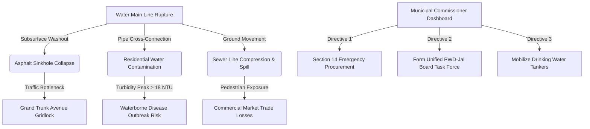

# UrbanPulse AI — Decision Intelligence Platform (Indian Mahanagar Edition)

[](#)
[](#)

UrbanPulse AI is an advanced Decision Intelligence Platform designed for City Commissioners, Municipal Corporations, and Disaster Management Teams in India to transform raw citizen reports and telemetry data into actionable, synchronized response plans.

This version is optimized for **Ward 144 — Sector 3 (Metro West Zone)**, showcasing a live dashboard that monitors and repairs cascading infrastructure failures under high load conditions.

---

## 🏗️ Project Architecture & Cascading Failure Workflow



---

## ⚡ Key Features

1. **Mahanagar Control Center:** High-level dashboard showing Ward Health Score, active complaints, emergency worker deployment, and regional risk alerts.
2. **Citizen Ingested Complaints Table:** A synchronized view of all reports categorized by municipal division, with custom severity, Priority Scores ($0\text{--}100$), and urgency trackers.
3. **Smart Duplicate Engine:** Uses semantic and spatial comparisons to cluster related complaints (e.g., merging duplicate road damage reports) to prevent redundant dispatch.
4. **Interactive Tactical Resource Allocator:** Let the commissioner test staffing configurations (30 workers) and instantly simulate resolution timelines and safety improvement ratings.
5. **Commissioner Directives Feed:** Click-to-execute policies that cut red tape and bypass standard 14-day tendering for instant, on-site response.
6. **AI Vision Verification:** Exposes subgrade road scans and reports confidence indices (95%) for structural pipe fractures.

---

## 🛠️ Municipal Departments & Tech Stack

* **Jal Board (Water & Sanitation):** Handles sewer blockages, water main pipeline repair, and disinfection.
* **PWD (Public Works Department):** Manages asphalt backfilling, concrete paving, and structural safety barricading.
* **Swachh Bharat Division:** Handles commercial solid waste compactors and market cleanup.
* **DISCOM (Electricity):** Manages regional streetlight grids.

**Frontend:** React, Vite, CSS Glassmorphism, Lucide-React.

---

## 🚀 Deployment Instructions

This project is configured to run locally or deploy to **Google Cloud Run** under the project ID `genai-apacsrija26`.

### Running Locally

1. Install dependencies:
   ```bash
   npm install
   ```
2. Run the local Vite server:
   ```bash
   npm run dev
   ```
3. Open `http://localhost:5173/` in your browser.

### Deploying to Google Cloud Run

To build and deploy the container to Google Cloud:

1. Authenticate with Google Cloud SDK:
   ```bash
   gcloud auth login
   ```
2. Set the target project:
   ```bash
   gcloud config set project genai-apacsrija26
   ```
3. Deploy directly using Cloud Run:
   ```bash
   gcloud run deploy urbanpulse-ai --source . --region asia-south1 --allow-unauthenticated
   ```

---
### 💖 Built with love by Special Grade Squad

