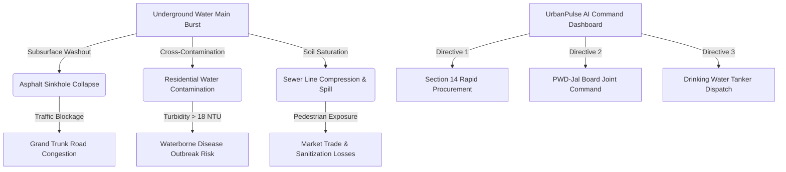
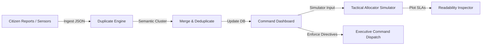

# UrbanPulse AI — Decision Intelligence Platform (Indian Mahanagar Edition)

[](#)
[](#)

UrbanPulse AI is an advanced, production-grade **Decision Intelligence Platform** designed for City Commissioners, Municipal Corporations, and Disaster Management Teams in India to transform raw citizen reports and telemetry data into actionable, synchronized response plans.

This version is optimized for **Ward 144 — Sector 3 (Metro West Zone)**, showcasing a live dashboard that monitors and repairs cascading infrastructure failures under high load conditions.

---

## 📖 Project Overview

Rapid urban expansion in Indian cities often creates fragmented municipal management. When a water pipe bursts, the Public Works Department (PWD) might repave a road without the Jal Board fixing the underlying leak, leading to recurring sinkholes and wasted funds.

**UrbanPulse AI** bridges this gap by acting as a single pane of glass command system. It ingests citizen complaints, automatically deduplicates them using a semantic similarity analyzer, simulates workforce resource allocations, and gives the Commissioner direct crisis powers to dispatch PWD, Jal Board, Swachh Bharat, and DISCOM workers synchronously.

---

## ⚡ Key Features

1. **Mahanagar Command Dashboard:**
   * **Incident Ingestion System:** An interactive form allowing direct submission of emergency incidents (calculates impact ranges and maps pins dynamically).
   * **Interactive Telemetry Map:** Blinking colored node coordinates representing active reports. Clicking map nodes directly focuses and inspects the incident card.
   * **Deduplication Engine:** Scans and clusters duplicates with 94% confidence indicators and click-to-merge actions.
2. **Tactical Resource Allocator:**
   * **Interactive Sliders:** Workforce staging calculator for 30 personnel.
   * **Staffing Ratio Charts:** HTML5 bar graphs calculating real-time load distribution ratios.
   * **Field Squads Coordinator:** A dropdown panel assigning active teams (e.g. PWD Unit 1, Jal Board Crew 3) to specific tickets.
3. **Executive Crisis Directives:**
   * **Emergency reserve ledger:** Ledger displaying INR 50 Lakhs reserve fund balances and transaction cost deductions.
   * **Digital Mandate Signatures:** Animates a digital approval signing flow before authorizing emergency orders.
4. **Spatial Predictions:**
   * **Subsurface GPR Scanner:** Sweeps radar frequencies across a grid to plot soil saturations and cavity voids.
   * **Pathogen Outbreak Risk Simulator:** Interactive circular dial plotting waterborne outbreak risks based on chemical flushing staff ratios.
5. **AI Advice:**
   * **Mission Objective Selector:** Toggles copilot parameters (maximize public safety, ledger economy, speed of SLA) to filter priorities.
   * **Interactive Command Prompter:** Interactive dialogue box compiling localized PWD and Jal Board strategies based on user query keywords.
6. **Live Telemetry Ingestion Log:** Monospace console terminal streaming live sensor updates at the bottom.

---

## 🛠️ Tech Stack

* **Frontend:** React, Vite, ES6+, Lucide-React.
* **Styling:** CSS3, custom theme variables, and grid layouts optimized for WCAG color contrast standards.
* **Server:** Production-ready Node.js static file server (`server.js`).
* **Containerization:** Multi-stage Docker build pipeline.
* **Cloud Platform:** Google Cloud Run.

---

## 🏗️ Architecture & Workflows

### Cascading Failure Workflow
When underground pipes burst, they trigger a cascade of municipal issues. UrbanPulse AI maps these dependencies:



### System Data Flow
How data flows through the UrbanPulse AI platform:



---

## 📸 Screenshots

The following UI screenshots are available in the project artifacts directory:
* **Command Dashboard Main View:** Visual map, metrics cards, duplicate checker card, and interactive tickets table.
* **Tactical Allocator View:** Resource slide configuration panel.
* **Log Console View:** Scrolling green-on-black terminal log.

---

## 🚀 Installation & Running Locally

Ensure you have [Node.js](https://nodejs.org/) installed (v18+ recommended).

1. Clone the repository:
   ```bash
   git clone https://github.com/srijabhattacharyya23-dot/UrbanPulse-AI.git
   cd UrbanPulse-AI
   ```
2. Install dependencies:
   ```bash
   npm install
   ```
3. Start the local Vite development server:
   ```bash
   npm run dev
   ```
4. Open your browser and navigate to `http://localhost:5173/`.

---

## ☁️ Deployment to Google Cloud Run

To build and deploy the container to Google Cloud:

1. Authenticate with Google Cloud SDK:
   ```bash
   gcloud auth login
   ```
2. Set the target project ID (ensure billing is enabled on the project):
   ```bash
   gcloud config set project your-project-id
   ```
3. Deploy directly using Cloud Run (builds container in Cloud Build and deploys):
   ```bash
   gcloud run deploy urbanpulse-ai --source . --region asia-south1 --allow-unauthenticated
   ```
4. Copy the output **Service URL** provided by Google Cloud Run.

---

## 🔒 Environment Variables

No heavy environment configurations are needed for this client-side demo version. You can configure:
* `PORT`: Port configuration for the static web server in `server.js` (defaults to `8080` for Cloud Run compliance).

---

## 🔮 Future Improvements

* **Active IoT API Integration:** Connect live physical water flow and garbage bin fill level sensors.
* **GIS Pipeline Mapping:** Embed real-time Mapbox/Leaflet spatial pipeline overlay grids.
* **Mobile Field Staff Portal:** A companion PWD/Jal Board app for field workers to mark repairs complete.

---

## 📄 License

This project is licensed under the MIT License - see the LICENSE section below for details:

```text
MIT License

Copyright (c) 2026 Special Grade Squad

Permission is hereby granted, free of charge, to any person obtaining a copy
of this software and associated documentation files (the "Software"), to deal
in the Software without restriction, including without limitation the rights
to use, copy, modify, merge, publish, distribute, sublicense, and/or sell
copies of the Software, and to permit persons to whom the Software is
furnished to do so, subject to the following conditions:

The above copyright notice and this permission notice shall be included in all
copies or substantial portions of the Software.
```

---
### 💖 Built with love by Special Grade Squad
